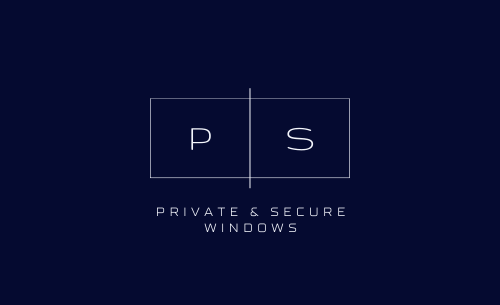

<p align="center">
    
</p>
<p align="center"><b>Privacy and security baseline for personal Windows 10 and Windows 11</b></p>

## Quick start

This will apply basic privacy and security settings for Windows 10 and Windows 11

```powershell
powershell.exe -ExecutionPolicy Unrestricted -File .\Install.ps1 -Level Basic
```

## What is this?

This is a handpicked collection of privacy and security settings for standalone Windows 10 and Windows 11 systems that tries to strike a good balance between privacy, security and usability. It uses group policy and is mainly based on Microsoft's own [Windows security baselines](https://docs.microsoft.com/en-us/windows/security/threat-protection/windows-security-configuration-framework/security-compliance-toolkit-10) and the [Windows Restricted Traffic Limited Functionality Baseline](https://docs.microsoft.com/en-us/windows/privacy/manage-connections-from-windows-operating-system-components-to-microsoft-services).

It comes with two security levels, based on your threat profile:

#### Basic security and privacy

Contains privacy and security settings that limits sharing of your personal information and improves the security configuration without extensively reducing performance or usability. 

- :bust_in_silhouette: For standalone and personal use systems
- :beetle: Helps protect against passive attacks (malware and attacks against many people at once) 

#### High-level security and privacy

Includes extra security settings for individuals with a higher threat profile. This includes enterprise-grade security settings and protections against physical attacks. This might reduce usability and performance, compared to the basic level.

- :busts_in_silhouette: For standalone, personal use systems and small domains/enterprises
- :dart: Helps protect against targeted attacks (dedicated hackers or other malicious agents trying to access your device specifically)

## How to use

Install the Basic security and privacy baseline:

1. Download the LGPO.exe tool from [Microsoft Security Compliance Toolkit](https://www.microsoft.com/en-us/download/confirmation.aspx?id=55319) and place it in the Tools folder.
2. (Optional, but recommended) Backup your current settings so you can revert later. Run `Backup.ps1` from the Utils folder. E.g. `.\Backup.ps1 -OutputDir C:\tmp\`
3. Run `Install.ps1` with PowerShell with administrative privileges.

```powershell
.\Install.ps1 -Level Basic
```

Use another value for `-Level` to select another baseline:

```powershell
-Level Basic                 [default] Basic security and privacy
-Level HighSecurity          High security settings (assumes basic security setting are in place)
Advanced use and more granular control: 
-Level BasicSecurity         Basic security, with no privacy settings added
-Level BasicPrivacy          Basic privacy, with no security settings added
-Level HighSecurityBitlocker A subset of high security settings: Disk encryption settings
-Level HighSecurityCredGuard A subset of high security settings: Virtualization-based security settings
-Level HighSecurityComputer  A subset of high security settings: Computer settings
-Level HighSecurityDomain    A subset of high security settings: Domain computer settings
-Level ExtremePrivacy        [experimental] Privacy settings that degrade security and usability
```

## FAQ

### Which Windows versions are supported?

- Windows 10, build 21H1 and newer
- Windows 11, build 21H2 and newer

In both cases, the **Enterprise** or **Education** editions of Windows are recommended. Pro will partially work, but some settings, such as telemetry, cannot be set to the desired level.

Windows Home edition is not supported.

### Why use this instead of CIS benchmark or Microsoft's security baseline?

Although both CIS' and Microsoft's security baselines are great, they are geared towards organizations using domain-joined computers. This baseline is made for personal/standalone computers, and includes additional settings for increased privacy.

### What is more important, privacy or security?

Both are important. This baseline tries both, but there are conflicts between them. In the following cases, privacy wins over security:

- Windows Defender does not send samples to Microsoft. 
- Smartscreen is disabled

Security and usability wins in some cases too, detailed below:

### Does this baseline stop all traffic sent to Microsoft services?

No. Traffic to Microsoft is limited, but for usability and security reasons, the following services still sends information to Microsoft:

- Windows Update is enabled to automatically download security updates
- Windows Defender signature updates are enabled to automatically download anti-malware definition updates
- Automatic Root Certificates Update is enabled to automatically check the list of trusted authorities on Windows Update to see if an update is available
- Network Connection Status Indicator (NCSI) sends a DNS request and HTTP query to http://www.msftconnecttest.com/connecttest.txt to determine if the device can communicate with the Internet. This is required to get Windows Updates and some other features
- The "Microsoft Account Sign-in Assistant" service (wlidsvc) is enabled. This is required to get Windows Updates.
- Telemetry is set to the lowest level availble for your Windows version. If you don't have the Enterprise/Education edition, some telemetry is still [sent to Microsoft](https://docs.microsoft.com/en-us/windows/privacy/configure-windows-diagnostic-data-in-your-organization).
- This baseline might have flaws and does not cover all possibilities. Please submit an issue if you see room for improvement.

### What are the usability implications of installing this?

Functionality related to Microsoft accounts, Cortana, OneDrive, Store, cloud, feedback and customer experience improvement are disabled or reduced.

### I want to change some of the settings

Everything is customizable through group policy:

1. To get an overview of your current settings, run `gpresult.exe /h GPreport.html` with administrative privileges. Then open the report in a browser and click "Show all". Identify the setting(s) you want to change and note their path.

2. To change a setting, run `gpedit.msc` with administrative privileges, and change the setting(s) identified in the step above. The paths in the GPreport corresponds with the gpedit tool. To reset a setting its default state, set it to "Not configured".

### What is the difference between the Basic and High security levels?

The High level has the following security improvements compared to the Basic level:

- Stronger User Account Control (UAC) settings
- Increased protection against physical attacks (Direct Memory Attack (DMA) protections, Sleep mode disabled, machine inactivity limit)
- Virtualization-based security features enabled (Hypervisor-Protected Code Integrity (HVCI), Secure launch)
- Enhanced logging enabled (audit, powershell, firewall)
- Hardening of Enterprise/domain features (Domain security settings, remote access like RDP and WinRM)
- More strict password policy

The privacy settings are equal in both levels.

### Does this baseline improve any applications?

No. Only the Windows operating system and built-in Windows components are covered. There are no improvements to Microsoft Edge and Internet Explorer included here.

## Credits

The main components of this baseline are

- Microsoft's [Windows Security baselines](https://docs.microsoft.com/en-us/windows/security/threat-protection/windows-security-configuration-framework/windows-security-baselines) and [Microsoft Security Compliance Toolkit](https://www.microsoft.com/en-us/download/confirmation.aspx?id=55319)
- Microsoft's [Restricted Traffic Limited Functionality Baseline](https://docs.microsoft.com/en-us/windows/privacy/manage-connections-from-windows-operating-system-components-to-microsoft-services)

I learned a lot from mxk's [Windows 10 and Server 2019 Secure Baseline GPO](https://github.com/mxk/win10-secure-baseline-gpo) and included some adjustments based on that baseline.